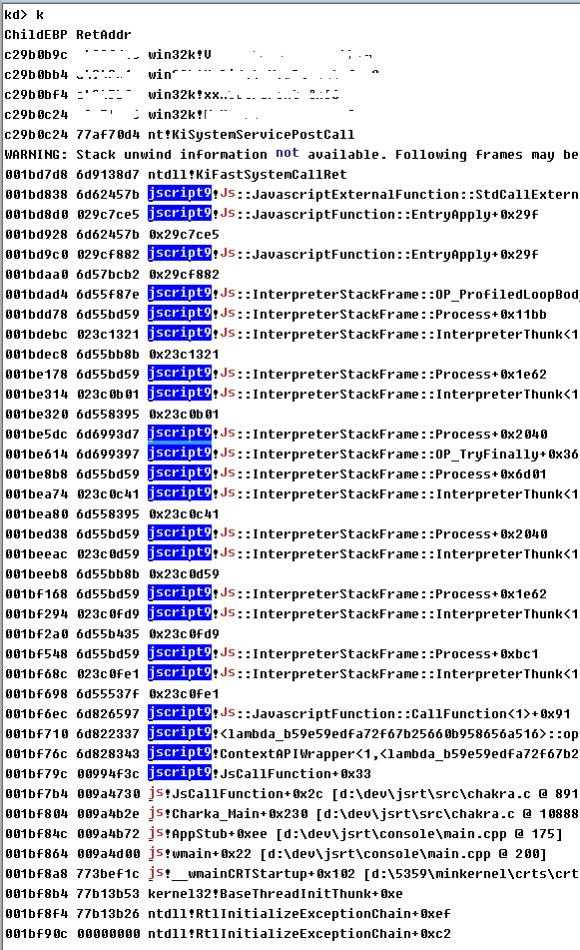

#Fuzz Windows Via Javascript

微软在今年2月和3月补了我去年年底报的2个win32k里的漏洞MS16-018/CVE-2016-0048 ,M16-034/CVE-2016-0096,

关于这2个漏洞的细节，各位同学有兴趣可以Diff一下,今天这篇不写.

对于这两个漏洞的背后的小故事,倒是有点意思。

fuzz的过程中，频繁的修改fuzzer代码，并验证思路是很普遍的过程。

为了保证fuzz环境的干净，虚拟机里没有安装任何第三方软件。所以

每次在物理机里修改完fuzzer代码,然后编译，然后传输到虚拟机里，是一件烦琐又低效的事情。

最开始fuzzer都是用C写的，所以在虚拟机里也装了一套WDK的编译环境，然后每次需要验证思路时，在虚拟机里，用Notepad++直接修改fuzzer代码，用WDK编译，执行结果。

 

去年8月初，无意间发现了微软的Chakra这个js引擎，

既然V8可以用来做nodejs, 辅助后端开发。

何不用用js来写fuzzer,语法和C很接近，想必修改代码起来会很方便， 移植之前c写的fuzzer也会很容易。

于是开始研究Chakra 的文档，这就是后来的JSRT项目, 意思是 Javascript Runtime ,

Chakra 本身只是一个基本js引擎，只能能执行基本的表达式。

在MS的文档里，对于只是想用js来作为插件语言的软件，给需要提供的SDK函数每一个都写一个包装函数，用JsCreateFunction注册后，js即可调用。

但是我的目标是用js来Fuzz内核，面对的是整个操作系统，win32的api函数太多了，不可能给每个函数都写一个c的包装函数，给js调用。

于是想到一些tips 来hack 这个过程。

由于js没有指针类型，而很多api函数都是需要传递指针类型的参数，这就需要让js具备直接操作内存的能力，对于指针本身，使用js里的整数来模拟。

使用c提供malloc/free, getCHAR…setULONG,等函数，js就能直接读写内存。

为了获取函数地址，首先得知道模块地址，所以我提供了LoadLibrary、GetModuleHandle

然后在GetProcAddress的帮助下，就能获取任意函数的地址。

具备了直接读写内存的能力，再加上函数地址的获取，就能直接的调用api了。

 
比如对于2个参数个数的stdcall类型函数，可以抽象为，

        RoutineResult = ((LPFN_STDCALL2Param)(RoutineAddress))(ArgArray[0], ArgArray[1]);

在 js 层 获取都是 DWORD类型的返回值，然后，手动转换成js类型即可。

对于参数比较简单的函数，如Beep，参数类型都是数值，很好处理。

但是对于 EnumWindow 这种，需要提供一个回掉函数作为参数。

就需要完成 js->c -> js 跨语言的过程。

对于js->c 比较好理解，但是c -> js 这个过程就有点麻烦了。

因为在 c->js 的过程中，除了js所需要的参数，还得传递Charka需要的当前Context等信息。

后来想到使用Thunk的思路，使用asm 来重新布局 栈上的参数，额外的传递 Chakra所需要的Runtime Context 信息， 当前js对象信息，和js 回掉函数对象。

 

这样，在C层面，只提供最小的辅助给Chakra，就能让js能直接跨语言调用所有api.

事实证明，这套JSRT还是很方便的。

比如在 调用 ShadowSSDT 里的函数时，无需定义参数原型，直接使用

function NtGdiAngleArc( arg_01,  arg_02 ,  arg_03,  arg_04 ,  arg_05,  arg_06 )
{

    return Invoke( W32pServiceTable["NtGdiAngleArc"] , arg_01,  arg_02 ,  arg_03,  arg_04 ,  arg_05,  arg_06 );

}

就能方便的调用任意SDT函数。

光有这些还不够，还需要一个js的基本库来辅助调用，比如js本身没有printf函数，等等。

期间因为频繁的被业务模块维护打断，断断续续的写了几个月。

去年11月初，因为某比赛的原因，切换目标到win32k, 刚好来验证这套环境的效果和方便性。

于是有了后来的 CVE-2016-0096 ，可能是第一个用js fuzz出来的内核洞。

蓝屏时，就可以看到一个很有意思的栈，从jscript一路到内核。

